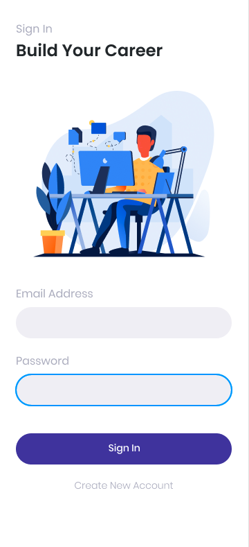
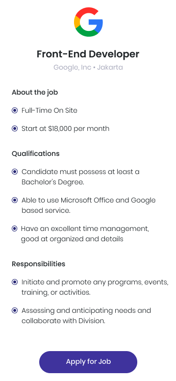

<!-- PROJECT LOGO -->
 

  

  <h3 align="center">Job Future - Mobile Flutter</h3>

  

    An awesome README template to jumpstart your projects!
     
    <a href="https://github.com/azharuanwar/"><strong>Explore the docs »</strong></a>
     
     
  

<!-- ABOUT THE PROJECT -->
## About The Project

  

 
 

 

 
 

  

 
 

### Built With

This section should list any major frameworks that you built your project using. Leave any add-ons/plugins for the acknowledgements section. Here are a few examples.
* [Flutter](https://flutter.dev)
* [Dart](https://dart.dev)
